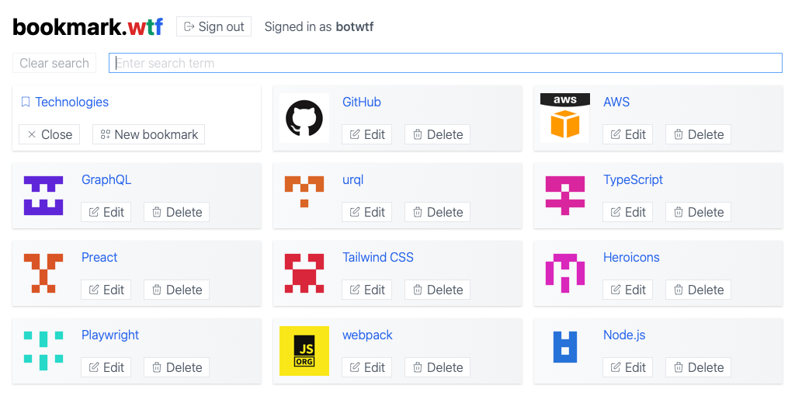

# bookmark.wtf

An open source developed bookmark manager with GitHub Gist as data backend.

1. To use this web app, you need to sign in to GitHub and give it permission to
   access your gists.
1. This web app does not track you or store data outside your browser or GitHub.
1. Your bookmarks are stored in markdown format in GitHub Gist. This allows you
   to use them without this web app. Please find
   [here](https://gist.github.com/9803bde974539a8992c0515b28db439b) an example.
1. You can manage as many gists and thus bookmark collections as you like.
1. By sharing the URL, other people can access your bookmark collections in
   read-only mode. Your bookmark collections, respectively your gists, are only
   "secret" as long as you do not share the URL with anyone.

**Disclaimer:** This web app is developed and operated by me in my spare time at
my own expense. Please use it at your own risk. There is a danger that due to
software bugs your data on GitHub Gist may be lost.

## Rationale

I implemented this web app mainly as a basis for experimenting with software
architecture design patterns. It offers a manageable but sufficiently complex
functional range and was implemented by me using state-of-the-art technology.
