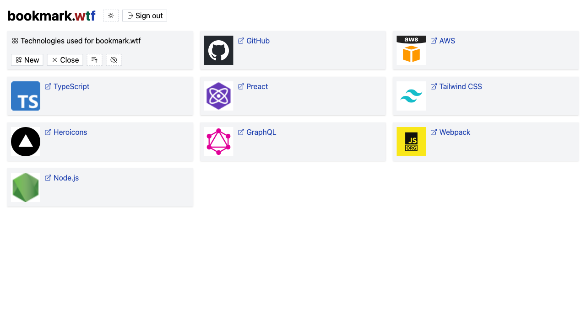

# bookmark.wtf

A free and open-source bookmark manager that uses GitHub Gist as database.

## Getting started

To get started, all you need to do is create a free GitHub account and allow
[bookmark.wtf](https://bookmark.wtf) to access your gists. You can do both in
one go by clicking on the `"Sign in with GitHub"` button.

**Disclaimer:** I do not know your account, nor do I have access to your
bookmark collections unless you explicitly share them with me via link. This
software is operated by me free of charge. You have no claim on the availability
of the service.

## Features

- You can create as many bookmark collections as you want. Each collection can
  contain a maximum of 300 bookmarks.
- Your bookmark collections are stored in Markdown format as GitHub gists.
- Others can see your bookmark collections and also fork if they know the link.
- You can easily add bookmarks to a collection using a bookmarklet.
- You can search for bookmarks within a collection. The search is stored in the
  URL and is therefore also linkable.

## Dark mode

## Light mode

